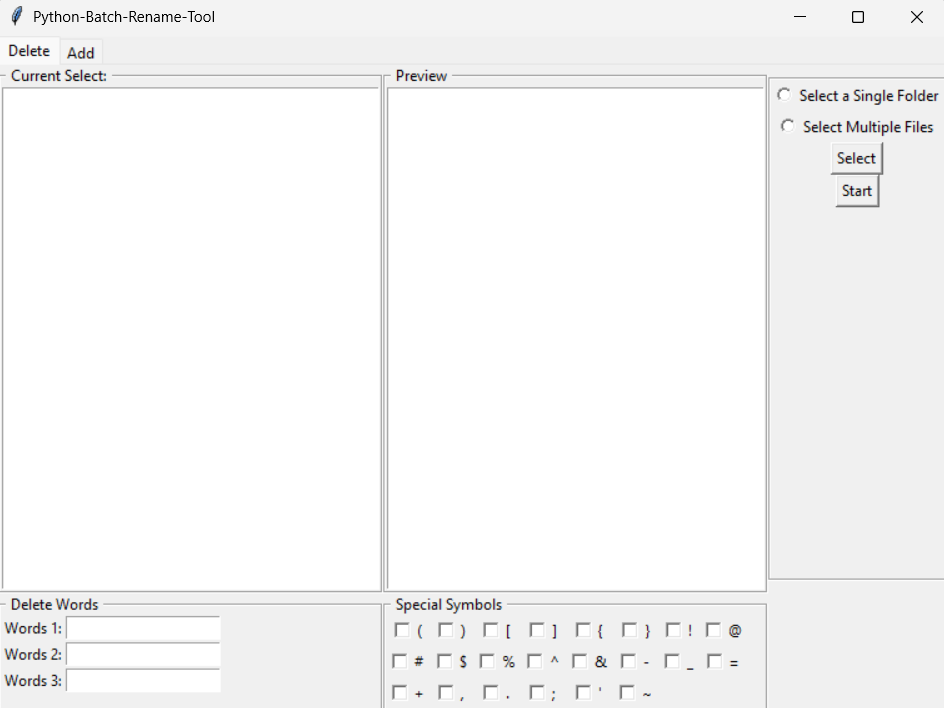

# Python Batch Rename Tool
A simple Python GUI tool for Batch Renaming Files.

## 📌 Features

- Batch rename multiple files
- Real-time preview before renaming
- Delete specific words from filenames
- Remove selected special symbols
- Add words to the beginning or end of filenames
- Option to automatically add a space when inserting words
- Two selection modes:
  - Select a single folder
  - Select multiple files

## 📸 Screenshots

## 🔍 Requirements

- Python 3.x

## ✅ Installation

Clone the repository:

git clone https://github.com/yourusername/python-batch-rename-tool.git

Navigate to the project folder:

cd python-batch-rename-tool

Run the program:

python main.py

## ❓ How to Use

1. Choose a mode:
   - Select a folder
   - Select multiple files
2. Click **Select** to load files.
3. Choose a renaming operation:
   - Delete words
   - Remove symbols
   - Add words to front or end
4. Check the **Preview** list to see the new filenames.
5. Click **Start** to rename the files.

## 🔱 License

All rights reserved.

This source code is published for viewing and learning purposes only.
You may not copy, modify, distribute, or use this code in any project without explicit permission from the author.
